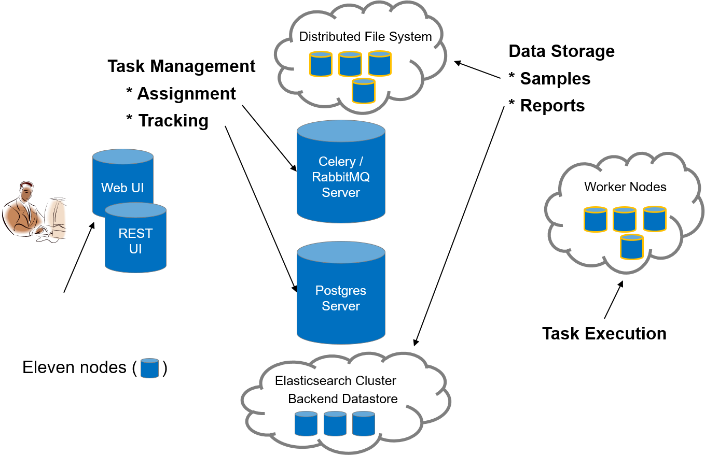
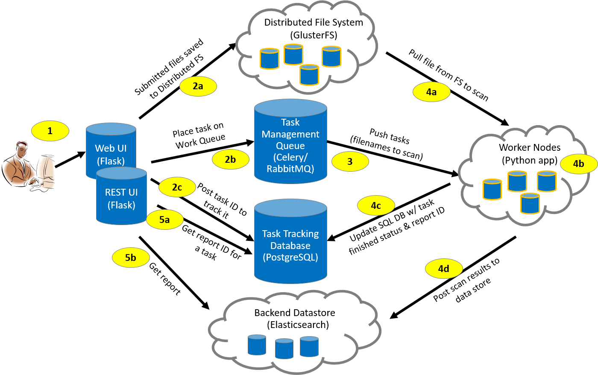

High-level Architecture
-----------------------
The MultiScanner architecture is shown in Figure 1. Task management components (Celery/RabbitMQ Server and Postgres Server) provide task assignment and tracking. Data storage is available for both malware samples (distributed file system) and analysis results (Elasticsearch cluster). Worker nodes execute tasks.

Workflow
--------
The MultiScanner workflow is shown in Figure 2. Each step is described below the figure.

The workflow is as follows:

1. The user submits a file through the Web (or REST) UI.
1. The Web (or REST) UI:
    a. Saves the file in the distributed file system
    a. Places the task on the work queue
    a. Posts and tracks Task ID
1. The task manager pushes the task (filename to scan) to a worker node.
1. The worker node:
    a. Pulls the file from the file system
    a. Analyses the file
    a. Updates the Postgres server with the task status (“finished”) and report ID
    a. Posts analysis results to the Elasticsearch datastore
1. The Web (or REST) UI:
    a. Gets report ID associated with the Task ID
    a. Pulls analysis report from the Elasticsearch datastore

Analysis Modules
----------------
MultiScanner is a file analysis framework that assists the user in evaluating malware samples by automatically running a suite of tools and aggregating the output. Tools can be custom built python scripts, web APIs, software running on another machine, etc. 
Analysis tools are incorporated by creating modules that run in the MultiScanner framework. Catagories include AV scanning, sandbox detonation, metadata extraction, and signature scanning. Details are provided in Section Y.

Analytics
---------
MultiScanner enables analytics to be run across its database. To date, there is one analytic based on ssdeep hashes, which identify clusters of similar samples.

Reporting
---------
Analysis data captured or generated by MultiScanner is accessible in three ways:

* MultiScanner Web User Interface – Content in the Elasticsearch database is viewable through the Web UI. See Section X for details. 

* MultiScanner Reports – MultiScanner reports reflect the content of the MultiScanner database and are provided in raw JSON reports. These reports capture all content associated with a sample.

* STIX-based reports are available in multiple formats: JSON, PDF, HTML, and text. 