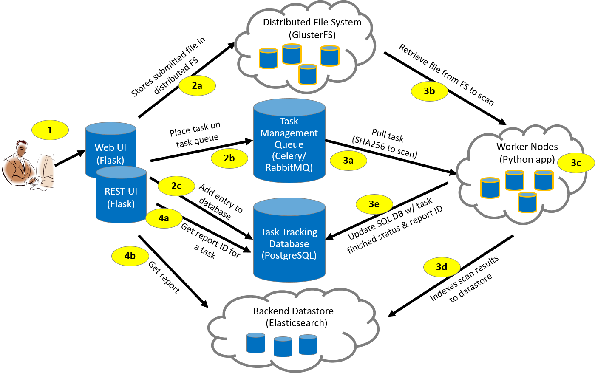

High-level Architecture
-----------------------
The MultiScanner architecture is shown in the figure below. Task management components (Celery/RabbitMQ Server and PostgreSQL Server) provide task assignment and tracking. Data storage is available for both malware samples (GlusterFS) and analysis results (Elasticsearch). Worker nodes execute tasks. Note that worker nodes are co-located with the distributed file system for improved performance.

Complete Workflow
-----------------
Each step of the MultiScanner workflow is described below the figure.

1. The user submits a file through the Web (or REST) UI.
1. The Web (or REST) UI:  
  a\. &nbsp; Saves the file in the distributed file system  
  b\. &nbsp; Places the task on the work queue  
  c\. &nbsp; Posts and tracks Task ID  
1. The task manager pushes the task (filename to scan) to a worker node.
1. The worker node:  
  a\. &nbsp; Pulls the file from the file system  
  b\. &nbsp; Analyses the file  
  c\. &nbsp; Updates the Postgres server with the task status (“finished”) and report ID  
  d\. &nbsp; Posts analysis results to the Elasticsearch datastore  
1. The Web (or REST) UI:  
  a\. &nbsp; Gets report ID associated with the Task ID  
  b\. &nbsp; Pulls analysis report from the Elasticsearch datastore  

Analysis Modules
----------------
MultiScanner is a file analysis framework that assists the user in evaluating malware samples by automatically running a suite of tools and aggregating the output. Tools can be custom built python scripts, web APIs, or software applications running on different machines. 
Analysis tools are integrated into MultiScanner via modules running in the MultiScanner framework. Existing module catagories include AV scanning, sandbox detonation, metadata extraction, and signature scanning. Details are provided in the [Using MultiScanner](using#default-analysis-modules) section.

Analytics
---------
MultiScanner enables analytics to be run across its database. Currently, there is one analytic based on ssdeep hashes, which identify clusters of similar samples.

Reporting
---------
Analysis data captured or generated by MultiScanner is accessible in three ways:

* MultiScanner Web User Interface – Content in the Elasticsearch database is viewable through the Web UI. See the [Using MultiScanner](using.md#web-user-interface) section for details. 

* MultiScanner Reports – MultiScanner reports reflect the content of the MultiScanner database and are provided in raw JSON reports. These reports capture all content associated with a sample.

* STIX-based reports are available in multiple formats: JSON, PDF, HTML, and text. 