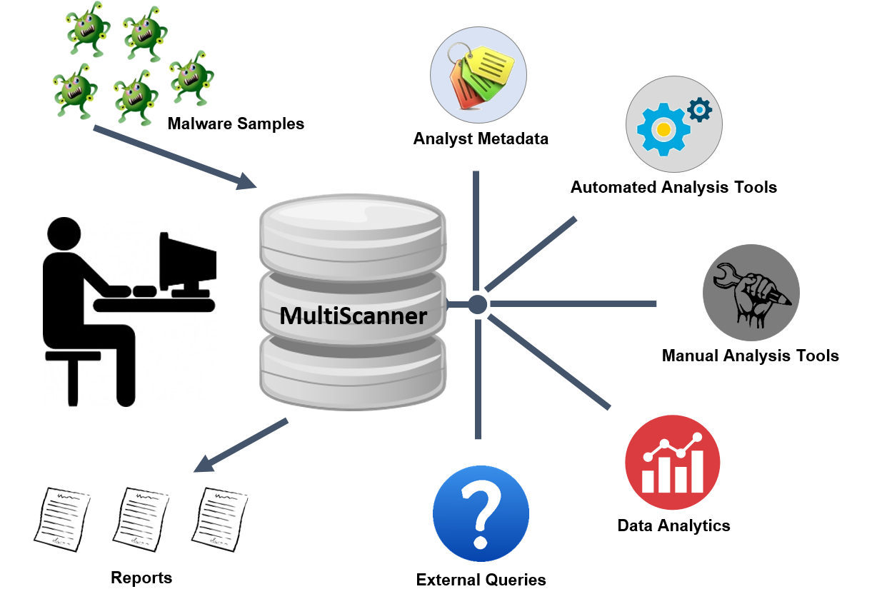

MultiScanner
==============
MultiScanner is a file analysis framework that assists the user in evaluating a set
of files by automatically running a suite of tools for the user and aggregating the output.
Tools can be custom built python scripts, web APIs, software running on another machine, etc.
Tools are incorporated by creating modules that run in the MultiScanner framework.

Modules are designed to be quickly written and easily incorporated into the framework.
Existing modules are related to malware analytics, but the framework is not limited to that
scope. For a list of modules, see [modules](modules), descriptions and config
options can be found in [docs/modules.md](docs/modules.md)

MultiScanner is available as open source in [GitHub](https://github.com/mitre/multiscanner/tree/feature-celery)

Key Capabilities
----------------
MultiScanner helps the malware analyst, tying everything together, providing integration and scaling capabilities and enabling analysis with multiple tools – both automated tools and manual tools. It allows analysts to associate metadata with samples and also allows integration of data from external sources. It’s particularly useful because all the data is linked across tools and samples, allowing analysts to pivot on data and to do analytics. 

