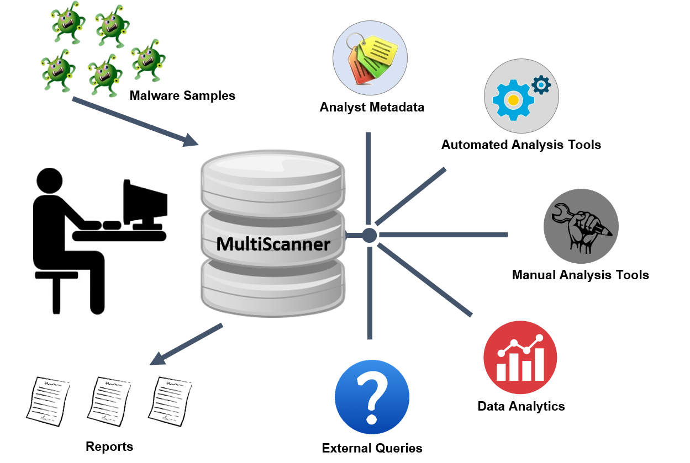

Overview
========
MultiScanner is a distributed file analysis framework that assists the user in evaluating a set
of files by automatically running a suite of tools for the user and aggregating the output.
Tools can be custom python scripts, web APIs, software running on another machine, etc.
Tools are incorporated by creating modules that run in the MultiScanner framework.

Modules are designed to be quickly written and easily incorporated into the framework.
Existing modules are related to malware analysis, but the framework is not limited in
scope. For descriptions of existing modules, see [Analysis Modules](use/use-analysis-mods.md). Module configuration options are given in [Installation](install#module-configuration).

MultiScanner supports a distributed workflow for sample storage, analysis, and report viewing. This functionality includes a web interface, a REST API, a distributed file system (GlusterFS), distributed report storage / searching (ElasticSearch), and distributed task management (Celery / RabbitMQ). See the [workflow diagram](arch.md#complete-workflow) for details.

MultiScanner is available as open source in [GitHub](https://github.com/mitre/multiscanner/tree/feature-celery).

Key Capabilities
----------------
MultiScanner helps the malware analyst, enabling analysis with automated tools and manual tools, providing integration and scaling capabilities, and corrolating analysis results. It allows analysts to associate metadata with samples and also allows integration of data from external sources. MultiScanner is particularly useful because all the data is linked across tools and samples, allowing analysts to pivot on data and to do analytics. 

